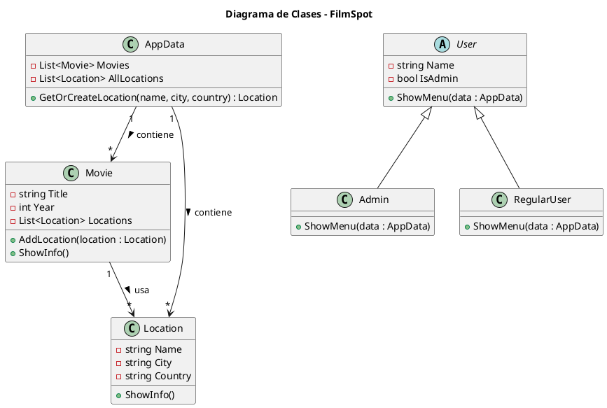

# FilmSpot

## Descripción general

**FilmSpot** es una aplicación de consola desarrollada en **C#** que permite explorar la relación entre **películas** y las **locaciones** donde fueron filmadas.  
Los usuarios pueden buscar películas para conocer en qué lugares se filmaron o buscar locaciones y descubrir qué películas se grabaron allí.  

El sistema implementa de forma práctica los **principios fundamentales de la Programación Orientada a Objetos (POO)**: **abstracción**, **encapsulamiento**, **herencia** y **polimorfismo**.  

Este proyecto fue desarrollado como parte de la asignatura **Desarrollo de Software I** del programa de **Maestría en Desarrollo de Software** en la **Universidad Politécnica de Tulancingo**.

---

## Objetivos del proyecto

- Aplicar los principios de POO en un caso práctico y funcional.
- Desarrollar una aplicación modular y extensible utilizando clases y herencia.
- Implementar un flujo de interacción mediante consola.
- Simular un sistema donde se pueda:
  - Registrar películas y sus locaciones.
  - Reutilizar locaciones entre distintas películas.
  - Buscar películas o locaciones y consultar sus relaciones.

---

## Estructura del sistema

El proyecto está compuesto por las siguientes clases principales:

### 1. `Movie`
Representa una película.  
Contiene:
- Título (`Title`)
- Año (`Year`)
- Lista de locaciones (`List<Location>`)

Permite agregar locaciones evitando duplicados y mostrar la información de cada película con sus locaciones asociadas.

### 2. `Location`
Representa una locación donde se filmó una o varias películas.  
Contiene:
- Nombre (`Name`)
- Ciudad (`City`)
- País (`Country`)

### 3. `User` (abstracta)
Clase base que representa a un usuario del sistema.  
Define atributos comunes:
- Nombre (`Name`)
- Rol (`IsAdmin`)

Y un método abstracto `ShowMenu(AppData data)` que es implementado de forma diferente por cada tipo de usuario (polimorfismo).

### 4. `Admin` (hereda de `User`)
El usuario administrador puede:
- Agregar películas.
- Agregar locaciones a películas.
- Reutilizar locaciones existentes o crear nuevas.
- Consultar todas las películas registradas.

### 5. `RegularUser` (hereda de `User`)
El usuario regular puede:
- Buscar una película y ver sus locaciones.
- Buscar una locación y ver qué películas se filmaron ahí.
- Consultar todas las películas y locaciones disponibles.

### 6. `AppData`
Contiene las listas globales del sistema:
- `Movies`: todas las películas registradas.
- `AllLocations`: todas las locaciones disponibles.

Además, implementa el método `GetOrCreateLocation()` para evitar duplicar locaciones cuando se reutilizan en distintas películas.

---

## Funcionamiento general

Al iniciar la aplicación, el usuario accede al **menú principal**, donde puede:
1. Ingresar como **Administrador**.
2. Ingresar como **Usuario Regular**.
3. Salir del programa.

Cada tipo de usuario ve un menú diferente:
- El **Administrador** puede registrar películas y locaciones.
- El **Usuario Regular** puede realizar búsquedas por nombre de película o por locación.

Los datos se mantienen en memoria durante la ejecución (sin persistencia en archivos o base de datos).

---

## Principios de Programación Orientada a Objetos aplicados

### Abstracción
Se utiliza la clase abstracta `User` para definir la estructura general de los usuarios del sistema.  
Esta clase obliga a las clases hijas (`Admin` y `RegularUser`) a implementar su propio menú, adaptado a su rol.

### Encapsulamiento
Cada clase controla su propio estado interno a través de propiedades con modificadores de acceso (`private`, `public`, `protected`).  
Por ejemplo, los atributos de `Movie` y `Location` solo pueden modificarse mediante sus constructores o métodos específicos.

### Herencia
Las clases `Admin` y `RegularUser` heredan de `User`.  
Esto permite compartir comportamientos comunes (como el nombre y rol) y personalizar el comportamiento del menú.

### Polimorfismo
El método `ShowMenu()` se comporta de forma diferente según el tipo de usuario.  
Aunque se invoca desde una referencia de tipo `User`, el comportamiento concreto depende del objeto (`Admin` o `RegularUser`).

## Diagrama de Clases



---

## Ejemplo de uso

1. El usuario inicia el programa.
2. Selecciona **Ingresar como Administrador**.
3. Agrega una película y una locación.
4. Cierra sesión y vuelve al menú principal.
5. Ingresa como **Usuario Regular**.
6. Busca una película o una locación y consulta los resultados.

El flujo permite alternar entre usuarios sin reiniciar la aplicación, manteniendo los datos en memoria.

---

## Ejecución

### 1. Crear el proyecto (si aún no existe)

```bash
dotnet new console -n FilmSpot
```

### 2. Ejecutar la aplicación

Desde la raíz del proyecto:

```bash
dotnet run
```

### 3. Estructura de archivos sugerida

```
FilmSpot/
├── Program.cs
├── AppData.cs
├── Models/
│   ├── Movie.cs
│   ├── Location.cs
│   └── Users/
│       ├── User.cs
│       ├── Admin.cs
│       └── RegularUser.cs
```

---
