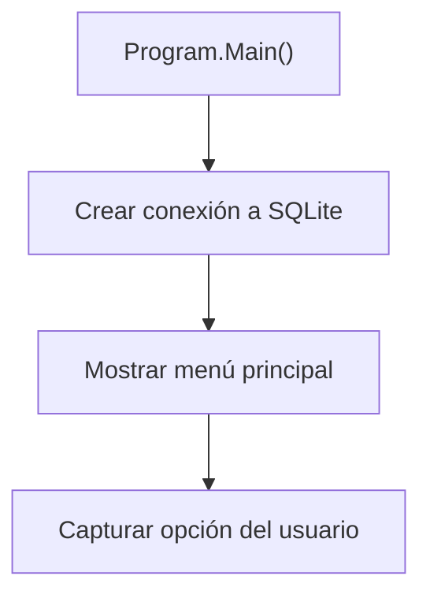
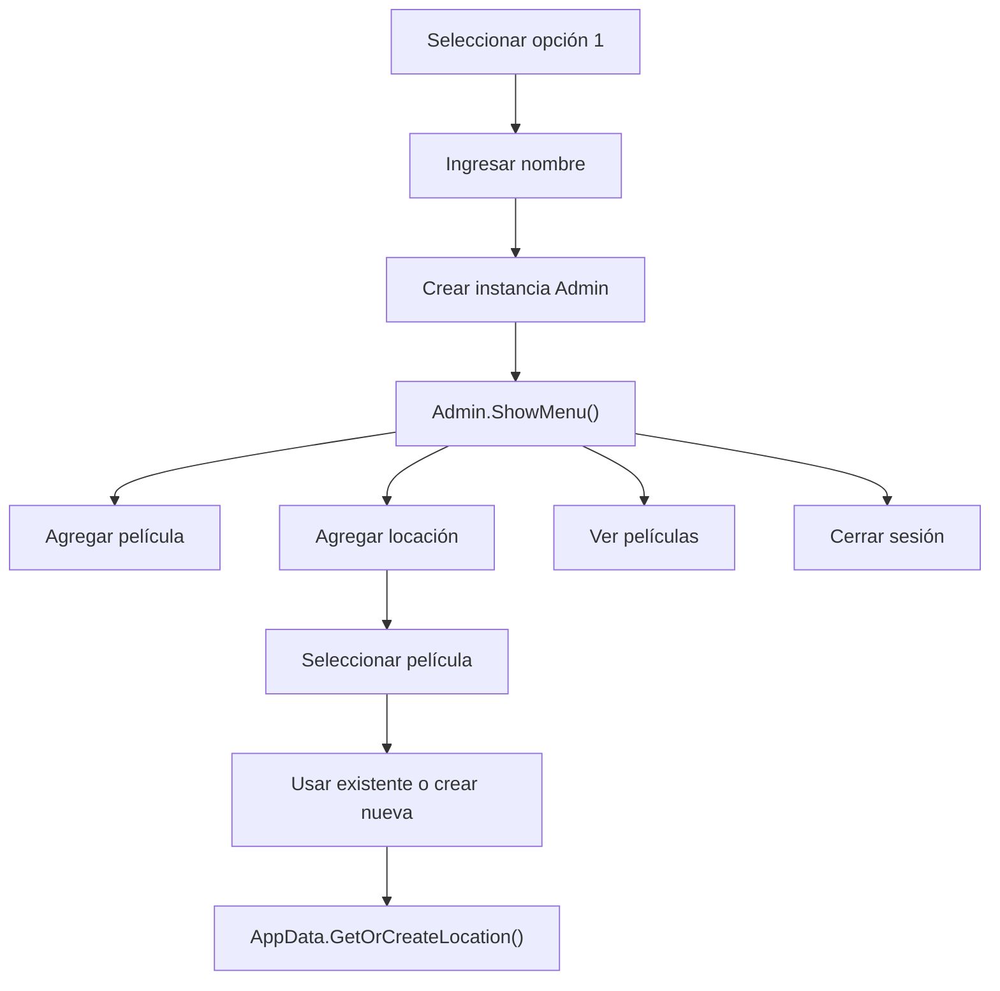
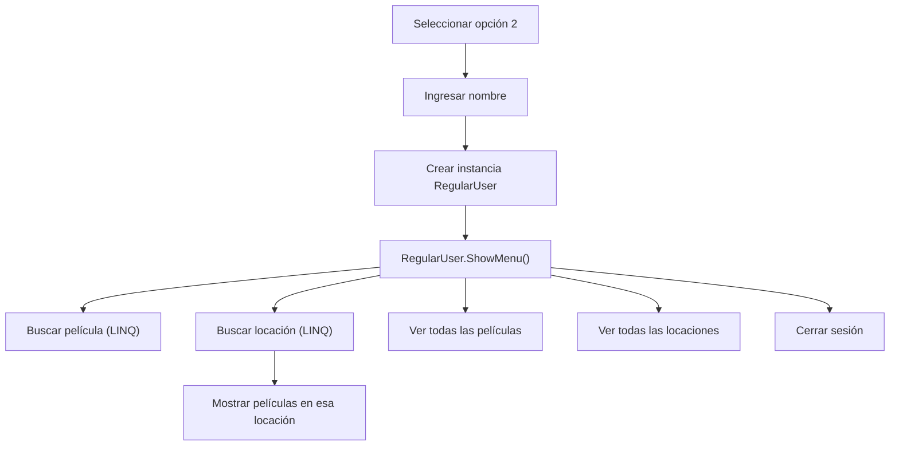
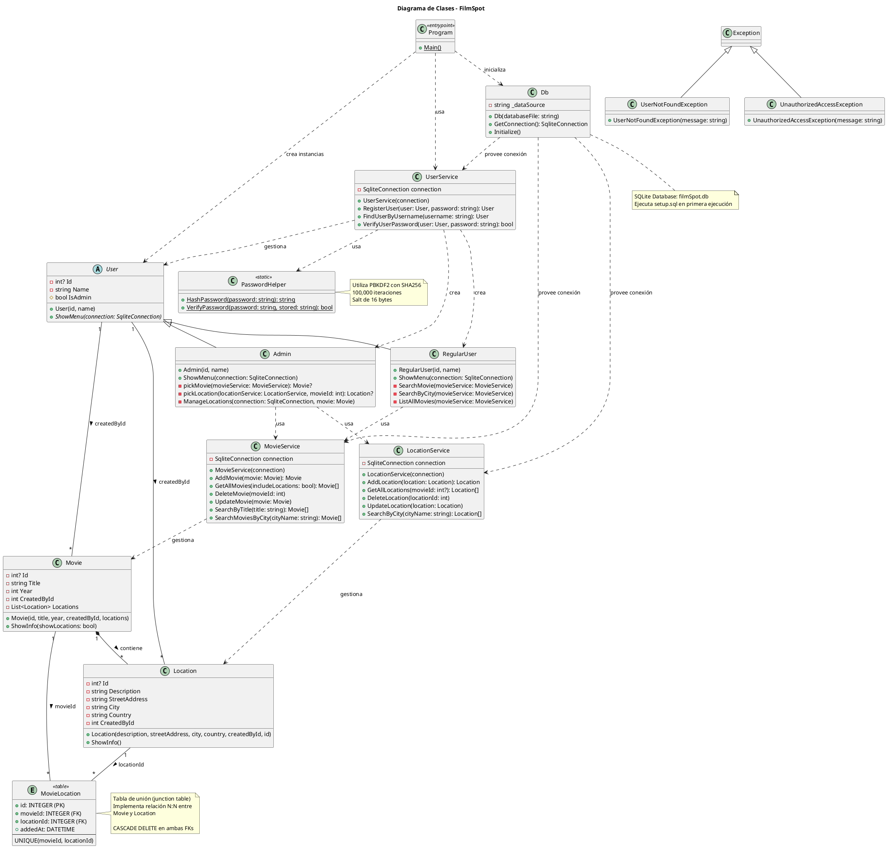

# Documentación Técnica - FilmSpot

## Tabla de Contenidos

1. [Introducción](#introducción)
2. [Arquitectura General](#arquitectura-general)
3. [Componentes Principales](#componentes-principales)
4. [Modelos de Datos](#modelos-de-datos)
5. [Gestión de Datos](#gestión-de-datos)
6. [Flujo de Ejecución](#flujo-de-ejecución)
7. [Diagrama de Clases](#diagrama-de-clases)

---

## Introducción

**FilmSpot** es una aplicación de consola desarrollada en C# que permite gestionar películas y sus locaciones de filmación. El sistema implementa un modelo de usuarios con dos tipos de roles: Administradores y Usuarios Regulares, cada uno con diferentes permisos y funcionalidades.

### Tecnologías

- **Lenguaje**: C#
- **Tipo de aplicación**: Aplicación de consola
- **Paradigma**: Programación Orientada a Objetos (OOP)

---

## Arquitectura General

El proyecto sigue una arquitectura por capas con separación de responsabilidades:

```
FilmSpot/
├── Program.cs             # Punto de entrada de la aplicación
└── Models/                # Modelos de dominio
    ├── Movie.cs           # Entidad Película
    ├── Location.cs        # Entidad Locación
    └── Users/             # Jerarquía de usuarios
        ├── User.cs        # Clase base abstracta
        ├── Admin.cs       # Usuario administrador
        └── RegularUser.cs # Usuario regular
```

### Principios de Diseño Aplicados

1. **Encapsulamiento**: Propiedades con setters privados y getters públicos
2. **Abstracción**: Uso de clases abstractas (`User`)
3. **Herencia**: Jerarquía de usuarios (Admin y RegularUser heredan de User)
4. **Polimorfismo**: Implementación de método abstracto `ShowMenu()`
5. **Single Responsibility**: Cada clase tiene una responsabilidad única

---

## Componentes Principales

### Program.cs

**Ubicación**: `/Program.cs`

**Responsabilidad**: Punto de entrada de la aplicación y menú principal.

#### Estructura

```csharp
namespace FilmSpot
{
    public class Program
    {
        public static void Main()
        {
            // Inicialización y bucle principal
        }
    }
}
```

#### Funcionalidades

- **Menú Principal**: Presenta opciones para ingresar como:
  - Administrador (opción 1)
  - Usuario Regular (opción 2)
  - Salir (opción 0)
- **Gestión de Sesiones**: Solicita el nombre del usuario y crea una instancia del tipo de usuario correspondiente

#### Flujo de Ejecución

1. Muestra el menú principal
2. Captura la entrada del usuario
3. Según la opción:
   - Crea un objeto `Admin` o `RegularUser`
   - Invoca el método `ShowMenu()` del usuario
4. Repite hasta que el usuario seleccione salir

**Referencia**: `Program.cs:9-53`

---

## Modelos de Datos

### 1. Location (Locación)

**Ubicación**: `/Models/Location.cs`

**Descripción**: Representa una locación de filmación geográfica.

#### Propiedades

| Propiedad | Tipo     | Acceso  | Descripción               |
| --------- | -------- | ------- | ------------------------- |
| `Name`    | `string` | Lectura | Nombre de la locación     |
| `City`    | `string` | Lectura | Ciudad donde se encuentra |
| `Country` | `string` | Lectura | País de la locación       |

#### Constructor

```csharp
public Location(string name, string city, string country)
```

Inicializa una nueva locación con los datos proporcionados.

#### Métodos

##### ShowInfo()

```csharp
public void ShowInfo()
```

- **Propósito**: Muestra la información de la locación en consola
- **Formato**: `{Name} - {City}, {Country}`
- **Referencia**: `Location.cs:18-21`

---

### 2. Movie (Película)

**Ubicación**: `/Models/Movie.cs`

**Descripción**: Representa una película con sus locaciones de filmación asociadas.

#### Propiedades

| Propiedad   | Tipo             | Acceso  | Descripción                      |
| ----------- | ---------------- | ------- | -------------------------------- |
| `Title`     | `string`         | Lectura | Título de la película            |
| `Year`      | `int`            | Lectura | Año de lanzamiento               |
| `Locations` | `List<Location>` | Lectura | Lista de locaciones de filmación |

#### Constructor

```csharp
public Movie(string title, int year)
```

Inicializa una película con título, año y una lista vacía de locaciones.

#### Métodos

##### AddLocation(Location location)

```csharp
public void AddLocation(Location location)
```

- **Propósito**: Agrega una locación a la película
- **Validación**: Verifica que la locación no esté duplicada (comparación case-insensitive)
- **Comportamiento**:
  - Si existe: Muestra mensaje de advertencia
  - Si no existe: Agrega la locación y confirma
- **Referencia**: `Movie.cs:20-34`

##### ShowInfo()

```csharp
public void ShowInfo()
```

- **Propósito**: Muestra información completa de la película
- **Formato**:
  ```
  {Title} ({Year})
    Locaciones:
     - {Location1}
     - {Location2}
  ```
- **Caso especial**: Si no hay locaciones, muestra mensaje informativo
- **Referencia**: `Movie.cs:36-47`

---

### 3. User (Usuario - Clase Abstracta)

**Ubicación**: `/Models/Users/User.cs`

**Descripción**: Clase base abstracta que define la estructura común de todos los usuarios del sistema.

#### Propiedades

| Propiedad | Tipo     | Acceso                      | Descripción                           |
| --------- | -------- | --------------------------- | ------------------------------------- |
| `Name`    | `string` | Lectura                     | Nombre del usuario                    |
| `IsAdmin` | `bool`   | Lectura/Escritura protegido | Indica si el usuario es administrador |

#### Constructor

```csharp
protected User(string name)
```

Constructor protegido que inicializa el nombre del usuario.

#### Métodos Abstractos

##### ShowMenu(SqliteConnection connection)

```csharp
public abstract void ShowMenu(SqliteConnection connection)
```

- **Propósito**: Muestra el menú específico de cada tipo de usuario
- **Parámetro**: `connection` - Una conexión abierta de SQLite
- **Implementación**: Debe ser implementado por las clases derivadas

**Referencia**: `User.cs:5-16`

---

### 4. Admin (Administrador)

**Ubicación**: `/Models/Users/Admin.cs`

**Descripción**: Usuario con permisos de administración para gestionar películas y locaciones.

#### Constructor

```csharp
public Admin(string name) : base(name)
```

Establece `IsAdmin = true` automáticamente.

#### Métodos

##### ShowMenu(SqliteConnection connection)

```csharp
public override void ShowMenu(SqliteConnection connection)
```

**Funcionalidades disponibles**:

1. **Agregar película** (Opción 1)

   - Solicita título y año
   - Valida que el año sea un número válido
   - Agrega la película a la lista
   - **Referencia**: `Admin.cs:31-42`

2. **Agregar locación a película** (Opción 2)

   - Muestra lista de películas existentes
   - Permite seleccionar una película
   - Ofrece dos opciones:
     - Usar una locación existente
     - Crear una nueva locación
   - Utiliza `GetOrCreateLocation()` para evitar duplicados
   - **Referencia**: `Admin.cs:44-101`

3. **Ver todas las películas** (Opción 3)

   - Lista todas las películas con sus locaciones
   - **Referencia**: `Admin.cs:103-109`

4. **Cerrar sesión** (Opción 0)
   - Retorna al menú principal

#### Validaciones Implementadas

- Verificación de entrada numérica con `int.TryParse()`
- Validación de índices de arrays
- Validación de strings vacíos con `Trim()`
- Manejo de valores null con operador `??`

**Referencia completa**: `Admin.cs:7-122`

---

### 5. RegularUser (Usuario Regular)

**Ubicación**: `/Models/Users/RegularUser.cs`

**Descripción**: Usuario con permisos de solo lectura para consultar información.

#### Constructor

```csharp
public RegularUser(string name) : base(name)
```

Establece `IsAdmin = false` automáticamente.

#### Métodos

##### ShowMenu(SqliteConnection connection)

```csharp
public override void ShowMenu(SqliteConnection connection)
```

**Funcionalidades disponibles**:

1. **Buscar película** (Opción 1)

   - Búsqueda por título exacto (case-insensitive)
   - Muestra información completa si se encuentra
   - **Referencia**: `RegularUser.cs:50-72`

2. **Buscar locación** (Opción 2)

   - Búsqueda por nombre o ciudad (búsqueda parcial)
   - Muestra las películas filmadas en cada locación encontrada
   - Usa LINQ para consultas complejas
   - **Referencia**: `RegularUser.cs:74-117`

3. **Ver todas las películas** (Opción 3)

   - Lista completa de películas registradas
   - **Referencia**: `RegularUser.cs:119-129`

4. **Ver todas las locaciones** (Opción 4)

   - Lista todas las locaciones del sistema
   - **Referencia**: `RegularUser.cs:131-142`

5. **Cerrar sesión** (Opción 0)
   - Retorna al menú principal

#### Características LINQ Utilizadas

- `FirstOrDefault()`: Búsqueda de película por título
- `Where()`: Filtrado de locaciones y películas
- `Any()`: Verificación de existencia
- `Contains()`: Búsqueda parcial de texto
- `ToList()`: Materialización de consultas

**Referencia completa**: `RegularUser.cs:7-144`

---

## Gestión de Datos

TODO

## Flujo de Ejecución

### 1. Inicio de la Aplicación



### 2. Flujo de Administrador



### 3. Flujo de Usuario Regular



---

## Diagrama de Clases



### Relaciones

- **Herencia**:
  - `Admin` y `RegularUser` heredan de `User`
  - `UserNotFoundException` y `UnauthorizedAccessException` heredan de `Exception`

- **Composición**:
  - `Movie` contiene una lista de `Location` (relación fuerte)

- **Dependencias**:
  - Los usuarios (Admin/RegularUser) usan los servicios (MovieService, LocationService)
  - Los servicios gestionan los modelos (Movie, Location, User)
  - `Program` orquesta toda la aplicación
  - `Db` provee conexiones a todos los servicios

- **Asociaciones (Base de Datos)**:
  - User → Movie (1:N via createdById)
  - User → Location (1:N via createdById)
  - Movie → Location (1:N via movieId)

- **Clases de Utilidad**:
  - `PasswordHelper`: Clase estática para hash y verificación de contraseñas
  - `Db`: Gestiona la conexión y configuración de SQLite

---

## Características Técnicas Destacadas

### 1. Gestión de Duplicados

El sistema implementa múltiples estrategias para evitar duplicados:

<!-- TODO: Replace AppData -->

#### En Location (AppData.cs:18-31)

```csharp
var existing = AllLocations.FirstOrDefault(l =>
    l.Name.Equals(name, StringComparison.OrdinalIgnoreCase) &&
    l.City.Equals(city, StringComparison.OrdinalIgnoreCase) &&
    l.Country.Equals(country, StringComparison.OrdinalIgnoreCase));
```

#### En Movie (Movie.cs:22-28)

```csharp
bool exists = Locations.Any(l =>
    l.Name.Equals(location.Name, StringComparison.OrdinalIgnoreCase) &&
    l.City.Equals(location.City, StringComparison.OrdinalIgnoreCase) &&
    l.Country.Equals(location.Country, StringComparison.OrdinalIgnoreCase));
```

### 2. Seguridad de Tipos

- Uso de `int.TryParse()` para validaciones numéricas
- Operador null-coalescing (`??`) para valores por defecto
- Null-forgiving operator (`!`) donde el contexto garantiza no-null

### 3. Búsquedas Case-Insensitive

Todas las búsquedas utilizan `StringComparison.OrdinalIgnoreCase` para mejorar la experiencia del usuario.

### 4. Encapsulamiento

Propiedades con setters privados protegen la integridad de los datos:

```csharp
public string Name { get; private set; }
```

### 5. LINQ

Uso extensivo de LINQ para consultas expresivas y legibles:

- `FirstOrDefault()`
- `Where()`
- `Any()`
- `Contains()`

---

## Consideraciones de Diseño

### Ventajas

1. **Separación de responsabilidades**: Clara distinción entre capas
2. **Extensibilidad**: Fácil agregar nuevos tipos de usuarios
3. **Mantenibilidad**: Código organizado y autodocumentado
4. **Reutilización**: Patrón Singleton para locaciones
5. **Validación**: Múltiples capas de validación de entrada

### Áreas de Mejora Potencial

1. **Persistencia**: Actualmente los datos solo existen en memoria
2. **Manejo de excepciones**: Podría ser más robusto
3. **Separación de UI**: La lógica de presentación está mezclada con la lógica de negocio
4. **Testing**: No hay separación clara para facilitar pruebas unitarias

---

## Convenciones de Código

### Naming Conventions

- **Clases**: PascalCase (`Movie`, `Location`)
- **Métodos**: PascalCase (`ShowMenu`, `AddLocation`)
- **Propiedades**: PascalCase (`Title`, `Name`, `IsAdmin`)
- **Variables locales**: camelCase (`title`, `userName`, `option`)

### Organización de Archivos

- Uso de namespaces para organización lógica
- Separación de modelos en carpeta dedicada
- Jerarquía de carpetas refleja jerarquía de clases

---

## Conclusión

FilmSpot es una aplicación bien estructurada que demuestra principios sólidos de programación orientada a objetos. La separación clara de responsabilidades, el uso de abstracción y herencia, y la implementación de patrones como Singleton para la gestión de locaciones, hacen que el código sea mantenible y extensible.

El sistema proporciona una base sólida que puede ser extendida con características adicionales como persistencia de datos, interfaz gráfica, o funcionalidades más avanzadas de búsqueda y filtrado.
